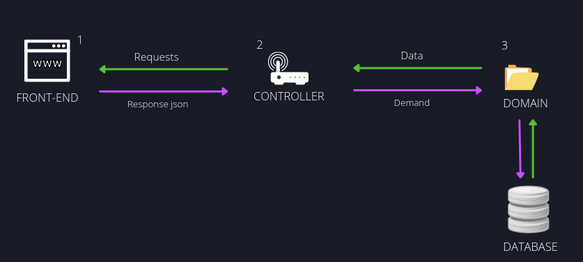

# Sales-Liferay-Training  
## Tecnologias usadas no Pojeto
### API Rest
Optei por desenvolver uma API para o  desafio em questão, atendendo todas as regras de negócio. Criando Endpoints para possibilitar o acesso Rest assim flexibilizando  o consumo da Aplicação seguindo o padrão de projetos MVC, onde a camada visual será em ReactJS.
A camada de resource, também conhecida  como controller, foi construída a partir 


### MVC
O MVC é um padrão de projetos que contribui na otimização de requisições feitas pelos usuários.Focada na implementação de interfaces, ela divide e dá a aplicação 3 interconectadas partes, modelo, controlador e visual;

* Modelo: é responsável por representar o negócio e o acesso a manipulação dos dados na sua aplicação.
* Visual: é responsável pela interface que será apresentada, mostrando as informações do modelo para o usuário;
* Controlador: É a camada responsável por ligar o modelo e a visual, fazendo com que os modelos possam ser repassados para os views e vice- versa.

.

### Service Builder 
Foi escolhido o Service Builder pois ele torna confiável a persistência da API. Essa ferramenta permite que seja mapeado do objeto-relacional, assim gerando as camadas de persistência,  modelo e camadas de serviço a partir de um único arquivo xml.

* **Camada de modelo:** define os objetos para representar as entidades do projeto.
* **Camada de persistência:** salva, lê, atualiza e deleta as entidades do banco de dados.
* **Camada de serviço:** é gerada uma camada em branco para aplicarmos a implementação das regras de negócio.
* **Serviço local:** Os serviços locais contêm a lógica de negócios e acessam a camada de persistência
* **Serviço Remoto:** Os serviços remotos geralmente contêm código de verificação de permissão 

		
### Gradle
O gradle foi utilizado para gerenciar as dependências e módulos do projeto, além de auxiliar a aplicação ao utilizar o service Builder em suas tarefas, e assim construir as camadas de modelo, serviço e persistência.  
## Como foi criado o projeto
* primeiro construa a estrutura do projeto com o auxilio da seguinte documentação [link](https://help.liferay.com/hc/en-us/articles/360018182411-Service-Builder-Template-).  

Observe que foram gerados 2 diretórios, um **task-api** e outro **task-service**.  

### Camada API e Service 
* O task-api tem como objetivo conter as interfaces de todoa as classes que seram usadas no projeto, para diminuir o aclopamento e aumentar a coesão do projeto, logo se uma classe deseja utilizar outra, a mesma deverá chamar a interface.

* O task-service tem como objetivo conter os serviços da sua aplciação, quando um serviço necessita de outro ele consome o serviço atráves de sua interface. Seguindo essa linha de raciocinio chamo sua atenção para a regra que há dentro da camada de serviço, pois eu terei o **serviço local** e o **serviço remoto**, onde o local é responsavel pela implementação das regras lógicas e realizar a persistência dos dados no banco, consumindo a camada de persistência ataravés de sua intereface, o serviço remoto é responsável por verificar as permissões do cliente validando o acessso ao serviço.


### Arquivos bnd.bnd e build.gradle
* **bnd.bnd:** responsáveis por caracterizar um pacote e definir quem pode enxerga-lo.  
* **build.gradle:** responsáveis por gerenciar as dependências dentro de um pacote, assim possibilitando que o pacote possa importar outro e enxerga-lo, se o mesmo o permitir em seu **bnd.bnd**, além de ser responsável por outras funcinalidades, como o mapeamento de arquivos a serem gerados pelas tarefas que podemos criar no gradle.

#### exemlpo:
* *bnd.bnd **task-api***
```bash
Bundle-Name: Liferay task API
Bundle-SymbolicName: com.liferay.task.api
Bundle-Version: 1.0.0
Export-Package:\
	com.liferay.task.exception,\
	com.liferay.task.model,\
	com.liferay.task.service,\
	com.liferay.task.service.persistence
```
* *build.gradle **task-api***
```bash
dependencies {
	compileOnly group: "com.liferay.portal", name: "release.portal.api"
}
```

* *bnd.bnd **task-service***
```bash
Bundle-Name: Liferay task Service
Bundle-SymbolicName: com.liferay.task.api
Bundle-Version: 1.0.0
Liferay-Service: true
```
* *build.gradle **task-service***
```bash
buildService {
	apiDir = "../task-api/src/main/java"
	testDir = "../task-test/src/testIntegration/java"
}

dependencies {
	compileOnly group: "com.liferay.portal", name: "release.portal.api"
	compileOnly project(":task-api")
}

```

### OSGI
.
